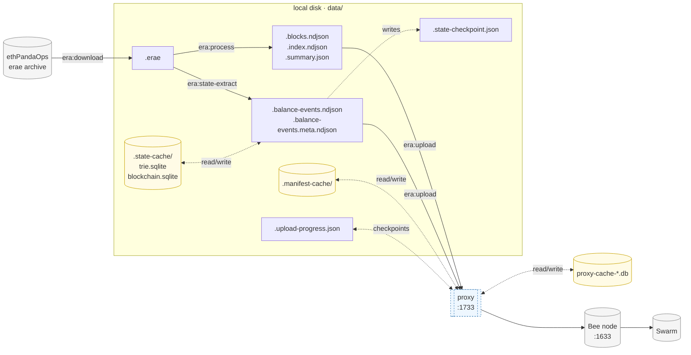
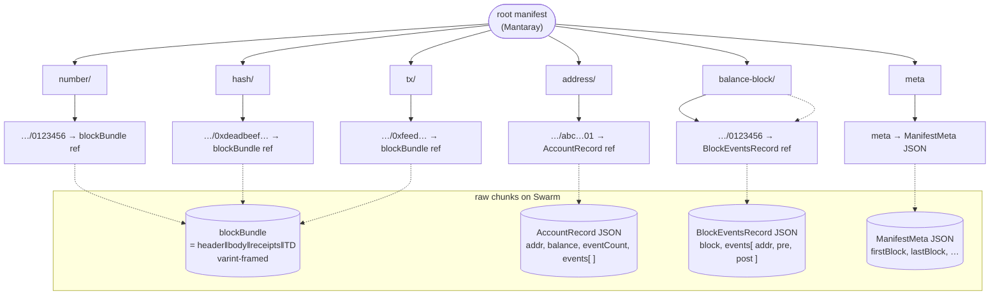

# FullCircle: Data Pipeline & Storage Layout

End-to-end map of how Ethereum mainnet history flows from ethPandaOps' erae
archives to Swarm, what each stage produces, and where every byte of cached
state lives on disk. Read alongside [README.md](../README.md) (CLI surface)
and [RESEARCH.md](./RESEARCH.md) (formats, protocols, prior art).

## Table of Contents

1. [Pipeline overview](#1-pipeline-overview)
2. [Stages](#2-stages)
3. [Local storage: `data/`](#3-local-storage-data)
4. [Caches in detail](#4-caches-in-detail)
5. [Swarm-side layout](#5-swarm-side-layout)
6. [Lifecycle: cold start, resume, refresh](#6-lifecycle-cold-start-resume-refresh)

---

## 1. Pipeline overview



Solid arrows are the data path; dotted arrows are caches that the stage
reads/writes opportunistically. The proxy is optional but recommended for any
upload to a non-local Bee — it adds upload-dedup, retry, and a content-keyed
response cache. See [§2.4](#24-upload).

## 2. Stages

Each stage is a single CLI script. Inputs come from the previous stage's
output (or upstream); outputs land in `data/` next to one another using a
shared `<fileBase>` (the basename of the source `.erae` file, e.g.
`mainnet-00007-fbd10bce`).

### 2.1 Download — `pnpm era:download [range]`

|                |                                                                                |
| -------------- | ------------------------------------------------------------------------------ |
| **Reads**      | `https://data.ethpandaops.io/erae/mainnet/<file>.erae`, `checksums_sha256.txt` |
| **Writes**     | `data/<fileBase>.erae`, `data/checksums_sha256.txt`                            |
| **Skipped if** | the `.erae` is already present (size check, no re-validation)                  |

Pure I/O. Source of truth for everything downstream — every other stage
re-reads from this cached file on subsequent runs.

### 2.2 Process — `pnpm era:process [range]`

|               |                                                                                  |
| ------------- | -------------------------------------------------------------------------------- |
| **Reads**     | `data/<fileBase>.erae`                                                           |
| **Writes**    | `<fileBase>.summary.json`, `<fileBase>.blocks.ndjson`, `<fileBase>.index.ndjson` |
| **Streaming** | one block at a time — peak RAM ~750 MB even for full eras                        |

Decompresses the snappy-framed E2Store records, decodes RLP headers/bodies
/receipts, hashes each block and each transaction. The blocks file holds the
**raw** header/body/receipts bytes (hex-encoded) per block, so downstream
uploaders never re-parse the source erae.

### 2.3 State extract — `pnpm era:state-extract [range]`

|            |                                                                                                                                                  |
| ---------- | ------------------------------------------------------------------------------------------------------------------------------------------------ |
| **Reads**  | `data/<fileBase>.erae`, `data/.state-cache/{trie,blockchain}.sqlite`                                                                             |
| **Writes** | `<fileBase>.balance-events.ndjson`, `<fileBase>.balance-events.meta.ndjson`, `<fileBase>.state-checkpoint.json`, the two `.state-cache/*.sqlite` |
| **Resume** | from `<previous-fileBase>.state-checkpoint.json` if `range` doesn't start at era 0                                                               |

Replays each block through `@ethereumjs/vm` against a `MerkleStateManager`
whose trie + blockchain are backed by **persistent SQLite** at
`data/.state-cache/`. A subclass overrides `putAccount` to emit one NDJSON
line per balance mutation (block reward, value transfer, gas accounting,
SELFDESTRUCT). At the end of each era it writes a small JSON marker with the
state root so the next run can `setStateRoot()` and skip the replay.

Pre-Byzantium mainnet only — that's where ethereumjs's VM is bit-perfect
against geth. See [STATE.md §11](./STATE.md) for status.

### 2.4 Upload — `pnpm era:upload --batch-id <id> [range]`

|              |                                                                                                             |
| ------------ | ----------------------------------------------------------------------------------------------------------- |
| **Reads**    | `<fileBase>.blocks.ndjson`, `<fileBase>.balance-events.ndjson`                                              |
| **Writes**   | `<fileBase>.upload-progress.json`, `data/.manifest-cache/`                                                  |
| **Sends to** | Bee `--bee-url` (default `http://localhost:1633`) — recommend pointing at the proxy `http://localhost:1733` |

Opens (or starts fresh) a 5-fork Mantaray manifest, uploads each block bundle
and each per-address / per-block balance record as raw Swarm chunks, mounts
their references under the right manifest fork. Saves the manifest exactly
once at the end (or every N blocks with `--save-every N`). The manifest
chunk cache short-circuits unchanged sub-trees on subsequent runs. See
[§5](#5-swarm-side-layout) for the on-Swarm layout.

### 2.5 Proxy (optional but recommended) — `pnpm proxy:start`

A TypeScript HTTP+WebSocket forward proxy that sits between any uploader
(`era:upload`, manual `curl`, the explorer) and any Bee. Default listen
`:1733`, default upstream `127.0.0.1:1633`.

|                           |                                                                                                   |
| ------------------------- | ------------------------------------------------------------------------------------------------- |
| **Cacheable HTTP**        | `POST /bytes`, `/chunks`, `/bzz`, `/soc/{owner}/{id}` — keyed by `(sha256(body), batch_id, path)` |
| **Cacheable WS**          | `/chunks/stream` — per-frame, body-hash keyed                                                     |
| **Mutable, never cached** | `/feeds/*`, `/stamps/*`                                                                           |
| **Retry**                 | exponential backoff on `ECONNRESET`/`ETIMEDOUT`, 5 attempts                                       |
| **Cache file**            | `data/proxy-cache-<host>_<port>.db`                                                               |

For mainnet uploads to flaky third-party Bees, the proxy turns repeat runs
into no-ops — re-uploading the same bytes with the same batch is a SQLite
hit, not a network round-trip. See [packages/proxy/](../packages/proxy/).

## 3. Local storage: `data/`

Everything below is gitignored. The same `<fileBase>` (e.g.
`mainnet-00007-fbd10bce`) groups all per-era artefacts.

```
data/
├── checksums_sha256.txt                       # downloaded once, lists every era's filename
│
├── <fileBase>.erae                            # § 2.1 raw archive (snappy-framed E2Store)
│
├── <fileBase>.summary.json                    # § 2.2 era summary  ── { firstBlock, lastBlock, txCount, ... }
├── <fileBase>.blocks.ndjson                   # § 2.2 one full block per line, raw hex
├── <fileBase>.index.ndjson                    # § 2.2 interleaved {kind:'block'|'tx', ...} records
│
├── <fileBase>.balance-events.ndjson           # § 2.3 one {block,addr,pre,post} per balance mutation
├── <fileBase>.balance-events.meta.ndjson      # § 2.3 one {kind:'block', block, hash, cumulative} per block
├── <fileBase>.state-checkpoint.json           # § 2.3 { era, lastBlockNumber, lastBlockHash, stateRoot, eventCountTotal, updatedAt }
│
├── <fileBase>.upload-progress.json            # § 2.4 manifestReference + sub-manifest refs at last checkpoint
│
├── .state-cache/                              # § 4.1 persistent VM caches
│   ├── trie.sqlite
│   └── blockchain.sqlite
│
├── .manifest-cache/                           # § 4.2 content-addressed Mantaray chunk cache
│   └── ab/cdef…01.bin                         # hex-prefix sharded
│
└── proxy-cache-127.0.0.1_1633.db              # § 4.3 proxy upload/download response cache
```

The full repo also has gitignored Bee runtime dirs at the workspace root —
`keys/`, `localstore/`, `stamperstore/`, `statestore/` — created by
`pnpm bee:start` when running the docker compose stack. Those belong to the
Bee node, not the FullCircle pipeline; the pipeline only sees Bee through
its HTTP API.

## 4. Caches in detail

Every cache below is **safe to delete at any time** — each is content- or
content-hash-keyed against an authoritative source, so a deletion just costs
the next run more wall-clock to repopulate.

### 4.1 `data/.state-cache/`

Backs the VM in `era:state-extract`. Two SQLite files, both wired into the
@ethereumjs DB interface via the [`SqliteDB`](../packages/era/src/state-cache.ts)
adapter (mirrors the proxy's `cache.ts` pattern: `node:sqlite`, WAL,
`PRAGMA synchronous = NORMAL`, single `kv(k TEXT PK, v BLOB)` table).

| File                | Wired into                               | Stores                                                   | Keyed by                   |
| ------------------- | ---------------------------------------- | -------------------------------------------------------- | -------------------------- |
| `trie.sqlite`       | `MerklePatriciaTrie` (`@ethereumjs/mpt`) | every Merkle Patricia trie node touched during VM replay | `keccak256(node)` (hex)    |
| `blockchain.sqlite` | `Blockchain` (`@ethereumjs/blockchain`)  | block headers, lookups, head pointers                    | mixed: hash, number, label |

Trie nodes are content-addressed — a value at key `keccak(node)` always
decodes to that exact node, so leftover rows from an aborted run are dead
weight, never wrong. The blockchain DB additionally tracks mutable head
pointers (`HeadHeader`, `HeadBlock`, `Heads`); on a clean re-run `createBlockchain`
re-derives them from the persisted blocks.

The companion `<fileBase>.state-checkpoint.json` is the **bookmark** into
these DBs — it records the state root at era boundary so a resume can
`setStateRoot()` and pick up exactly where the previous run left off.

### 4.2 `data/.manifest-cache/`

Backs the streaming Mantaray manifest in `era:upload`. Each file is one
Mantaray chunk, named by its Swarm reference (BMT hash, hex-encoded, sharded
by the first byte for filesystem friendliness): `data/.manifest-cache/<aa>/<bb...>.bin`.

|                |                                                                                     |
| -------------- | ----------------------------------------------------------------------------------- |
| **Read path**  | when the manifest spine is hydrated, the loader checks this dir before going to Bee |
| **Write path** | every chunk uploaded to Bee is also written here (cached saver)                     |
| **Atomicity**  | temp + rename, with PID-tagged tmp names so concurrent saves can't collide          |
| **Disable**    | `pnpm era:upload --no-manifest-cache …`                                             |

Like trie nodes these are content-addressed (BMT hash), so the cache is
always consistent with whatever's on Swarm.

### 4.3 `data/proxy-cache-<host>_<port>.db`

Backs the `@fullcircle/proxy`. Per-upstream so switching `--upstream` doesn't
cross-contaminate caches.

| Table            | Keyed by                         | Stores                                                                                                       |
| ---------------- | -------------------------------- | ------------------------------------------------------------------------------------------------------------ |
| `upload_cache`   | `(sha256(body), batch_id, path)` | the 2xx HTTP response (status, headers JSON, body) for `POST /bytes \| /chunks \| /bzz \| /soc/{owner}/{id}` |
| `download_cache` | `path`                           | the 2xx response for content-addressed `GET /bytes/{ref}` and `/chunks/{ref}`                                |

The WS path (`/chunks/stream`) reuses the upload table keyed only by frame
hash. Non-2xx responses are passed through and never stored. Override the
file via `--cache-db <path>`; disable with `--cache-db off`.

## 5. Swarm-side layout

What actually ends up on Swarm at the end of `era:upload`:



- **Five lookup forks** — the same block bundle is referenced by three of
  them (`number/`, `hash/`, `tx/`); state lookups go through `address/` and
  `balance-block/`. Mantaray's content-address dedup means a tx that lives
  in block N adds one fork edge under `tx/`, not a copy of the bundle.
- **Block bundle format** — defined in [packages/era/src/bundle.ts](../packages/era/src/bundle.ts);
  varint-prefixed concatenation of header, body, receipts, total difficulty.
- **State records** — JSON for legibility while the schema settles. Each
  account record carries the full event log block-ordered so a single fetch
  answers "balance history of `0xAbc…`".
- **Resumable** — `<fileBase>.upload-progress.json` records both the root
  manifest ref and the per-fork sub-manifest refs after each checkpoint, so
  an interrupted upload picks up at the last save without re-uploading
  unchanged chunks.

## 6. Lifecycle: cold start, resume, refresh

| Scenario                                           | What runs                                                                         | Re-uses                                                                | Re-does                         |
| -------------------------------------------------- | --------------------------------------------------------------------------------- | ---------------------------------------------------------------------- | ------------------------------- |
| Fresh clone, build era 0..6                        | `download` → `process` → `state-extract 0..6` → `upload 0..6`                     | nothing                                                                | everything                      |
| Same machine, add era 7                            | `download 7` → `process 7` → `state-extract 7` → `upload 7`                       | `.state-cache/`, `.manifest-cache/`, `.erae`/`.blocks.ndjson` for 0..6 | only era-7-specific work        |
| Re-extract state for era 5 only (skip 0..4 replay) | `state-extract 5` (uses era-4 checkpoint)                                         | `.state-cache/`, era-4 `.state-checkpoint.json`                        | re-runs VM for era 5 only       |
| Re-upload after Bee restart                        | `upload 0..6 --manifest <root>`                                                   | `.manifest-cache/`, all on-Swarm chunks via proxy                      | manifest walk + uncached chunks |
| Force-refresh state from genesis                   | `rm -rf data/.state-cache data/*.state-checkpoint.json` then `state-extract 0..N` | `.erae` files                                                          | full VM replay                  |
| Force-refresh proxy cache                          | `rm data/proxy-cache-*.db` (or run with `--cache-db off`)                         | nothing                                                                | next request goes upstream      |

The ordering across stages matters but the inputs/outputs are stable:
deleting any cache only affects wall-clock for the next run, never
correctness.
